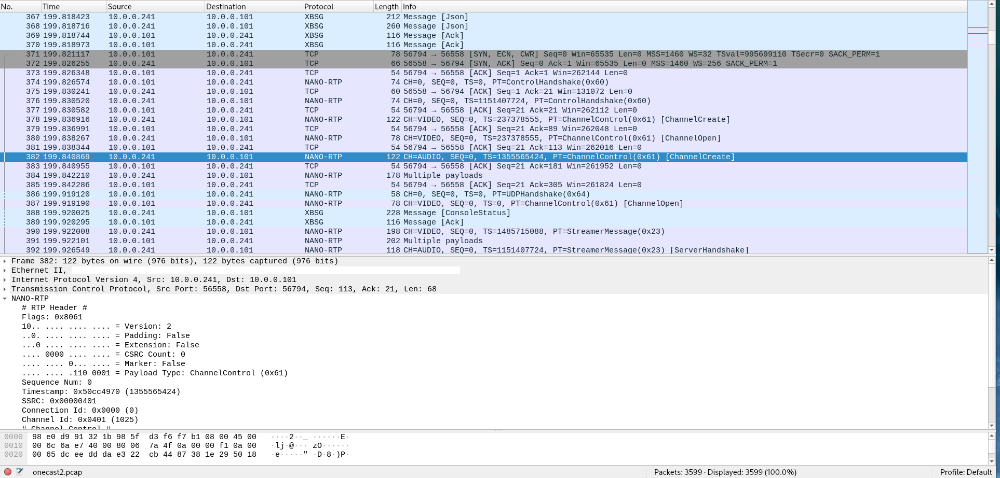

====================
Wireshark dissectors
====================

Find wireshark plugins folder
-----------------------------

1. Start wireshark
2. In the top navigation bar, select **Help -> About Wireshark**
3. Select tab **Folders**
4. Look for **Personal/Global Lua plugins**

Usage
-----

The SmartGlass protocol (UDP port 5050) gets dissected automatically.
For Nano, the individual TCP and UDP stream needs to be selected.

1. Mark a packet of the new UDP and TCP stream that appears right after the JSON messaging of SmartGlass
2. Right-click the packet
3. Choose **Decode As**
4. Navigate to **NANO-RDP** in the dropdown list
5. Confirm, Save

Install by referencing paths to lua dissector files
---------------------------------------------------

NOTE: For **PERSONAL Lua plugins directory** you have to create that file first

1. Open up *Lua plugins dir*/init.lua
2. Add the following **AT THE END** of the file

::

  local SG_SCRIPT_PATH = "C:\\Users\\username\\misc_repo\\wireshark\\"
  dofile(SG_SCRIPT_PATH.."smartglass.lua")
  dofile(SG_SCRIPT_PATH.."nano.lua")

Install by moving lua dissector files
-------------------------------------

1. Go to *Lua plugins dir*
2. Create a new folder (f.e. 'smartglass')
3. Move **smartglass.lua** and **nano.lua** to that new folder
